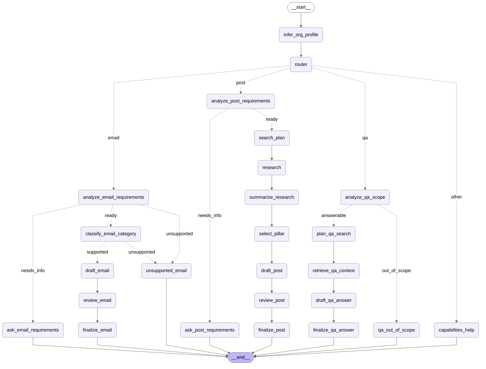
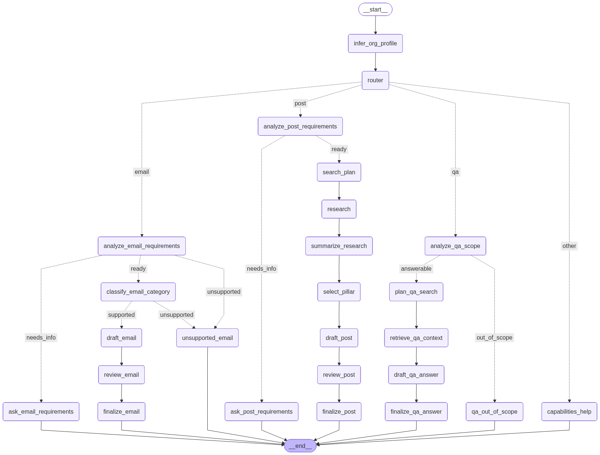

# Vee Assignment - Maggie Nonprofit Assistant

This repository contains a conversational AI assistant for nonprofit organizations built with LangChain and LangGraph. The assistant runs in a CLI, learns the organization's context from its website, and then supports three core workflows from a single conversation:

- create platform-specific social media posts
- draft one of three supported nonprofit email types
- answer organization-related questions using website context and web research

The implementation was designed to satisfy the assignment requirements in `assignment.md` while keeping the system understandable, inspectable, and easy to run locally.

## Workflow Diagram

The graph below is generated from the compiled LangGraph workflow in the codebase, not drawn manually.



<!--  -->

To regenerate the diagram after graph changes:

```bash
uv run python scripts/export_workflow_graph.py
```

The script also writes Mermaid source to `docs/assistant-workflow.mmd`.

## Assignment Coverage

| Assignment item                              | Status          | Notes                                                                                                         |
| -------------------------------------------- | --------------- | ------------------------------------------------------------------------------------------------------------- |
| Conversational chat agent                    | Implemented     | Single CLI chat loop backed by one LangGraph `StateGraph`.                                                    |
| Social media post creation                   | Implemented     | Researches context, selects one of the 5 nonprofit content pillars, and drafts for LinkedIn, Instagram, or X. |
| Email drafting                               | Implemented     | Supports only the 3 allowed categories from the assignment.                                                   |
| Organization Q&A                             | Implemented     | Answers organization-related questions using website scraping plus web search.                                |
| README with run instructions                 | Implemented     | Includes setup, usage, architecture, observability, evaluation, and limitations.                              |
| Architecture / thought process documentation | Implemented     | See `Architecture And Design Decisions` below.                                                                |
| Observability bonus                          | Implemented     | CLI streaming of graph node updates and optional LangSmith traces.                                            |
| Evaluation bonus                             | Implemented     | LangSmith-backed evaluation harness with deterministic and judge-based evaluators.                            |
| Anti-repetition bonus                        | Not implemented | Omitted due to time constraints; see `Limitations And Future Work`.                                           |

## What The Assistant Does

The assistant is intentionally organized around three user-facing capabilities.

### 1. Social Media Posts

For post requests, the agent:

1. routes the request into the post branch
2. asks a follow-up if the prompt is missing important details such as platform or topic preference
3. plans a research query
4. retrieves recent context from the web
5. selects the best nonprofit content pillar automatically
6. drafts a post tailored to the target platform
7. reviews the draft before returning the final version

Supported platforms:

- LinkedIn
- Instagram
- X / Twitter

Supported pillar selection:

- Impact & Mission
- Education & Awareness
- Community & Events
- Fundraising & Donations
- People & Culture

### 2. Email Drafting

The email branch only accepts the three categories required by the assignment:

- Donation Thank You Email
- Inform about Volunteering Opportunities
- Ask Availability for a Meeting

The agent first uses an LLM requirement check to decide whether the request is specific enough to draft. If the request only names a category, or leaves the category ambiguous, Maggie asks for the missing information before continuing. Unsupported email types are rejected instead of being force-fit into the allowed categories.

### 3. Organization Q&A

Users can ask organization-related questions directly, even if they do not explicitly say they want a Q&A flow. The graph routes those requests into a QA branch that:

1. determines whether the question is actually about the organization and answerable from public context
2. searches the organization's website
3. performs broader web research
4. synthesizes an answer
5. returns source URLs with the final response

This keeps the assistant useful for informational questions such as services, programs, initiatives, recent activity, or public-facing organizational details.

## Tech Stack

- Python 3.13+
- `uv` for environment and dependency management
- LangGraph for stateful graph orchestration
- LangChain and `langchain-openai` for model integration
- OpenAI models for routing, structured decisions, drafting, and review
- Jina AI Reader and Search endpoints for website scraping and web retrieval
- LangSmith for optional tracing and automated evaluation

## Local Setup

### Prerequisites

- Git
- Python 3.13+
- `uv`

If `uv` is not installed yet, follow the official installation guide at [docs.astral.sh/uv](https://docs.astral.sh/uv/getting-started/installation/).

### Installation

Clone the repository and install dependencies:

```bash
git clone <your-repo-url>
cd vee-assignment
uv sync
```

Create your environment file:

```bash
cp .env.example .env
```

### Required Environment Variables

Set these values in `.env`:

- `OPENAI_API_KEY`
- `JINA_API_KEY`

`JINA_API_KEY` can be created from the Jina website, and Jina offers a free tier that is sufficient for trying the project locally.

### Optional Environment Variables

- `OPENAI_MODEL` - defaults to `gpt-4.1-mini`
- `REQUEST_TIMEOUT_SECONDS` - defaults to `20`
- `ENABLE_OBSERVABILITY_STREAM` - prints high-level LangGraph node updates in the CLI
- `OBSERVABILITY_STREAM_PREFIX` - prefix for streamed trace lines
- `LANGSMITH_API_KEY` - enables LangSmith evaluation and trace uploads
- `LANGSMITH_TRACING` - usually set to `true` when using LangSmith
- `LANGSMITH_PROJECT` - project name for LangSmith traces and experiments
- `LANGSMITH_ENDPOINT` - defaults to LangSmith's hosted endpoint

The example environment file is in `.env.example`.

## Running The Assistant

Start the assistant with:

```bash
uv run vee-assignment
```

You can also run the entrypoint directly:

```bash
uv run python main.py
```

The current CLI onboarding flow asks for an organization website URL at the beginning of the session, scrapes the site, infers the organization name, and then opens the chat. This is the primary grounding mechanism used by the current implementation.

Example prompts:

- `Help me draft a LinkedIn post about our volunteer cleanup day.`
- `I want help drafting a donor thank-you email for people who gave during our spring campaign.`
- `Can you draft an email asking board members for meeting availability next week and mention the budget review?`
- `What services does this organization provide?`

Type `exit` or `quit` to end the session.

## Example Conversation Flow

The assistant is intentionally conversational rather than single-shot.

For post drafting, Maggie does not immediately invent a topic when the request is underspecified. Instead, it asks whether the user has a specific topic in mind or wants Maggie to suggest one based on recent organization-related information.

For email drafting, Maggie checks that the request belongs to one of the three supported categories and asks for missing details before drafting. Category-only prompts are treated as incomplete.

For organization questions, Maggie first decides whether the question is in scope. If it is, the assistant answers with public context and sources. If it is not, the assistant redirects the user instead of hallucinating.

## Architecture And Design Decisions

The system uses a single unified `StateGraph` in `src/vee_assignment/graph/assistant.py`. I chose one graph instead of separate apps for post generation, email drafting, and Q&A because the assignment calls for a conversational assistant, not three unrelated tools. A unified graph makes it easier to preserve session context, share organization grounding, and keep branching logic explicit.

The top-level router decides whether a user message is best handled as a post request, an email request, an organization question, or a general out-of-scope turn. From there, each branch applies its own specialized logic. This separation keeps intent classification lightweight while allowing branch-specific requirement checks to be much more detailed.

### Why Requirement Gating Uses The LLM

Earlier heuristic approaches are brittle for natural language inputs. The current implementation uses structured LLM decisions to determine whether a post or email request contains enough information to proceed. This is important because users can express the same need in many ways, and a strict keyword-based system would either over-block or draft content too early.

The requirement-gating stage populates branch-specific state such as missing fields, extracted category or platform, and the follow-up question to ask next. That lets the graph pause naturally, collect clarification, and then resume the same branch with merged context.

### Why QA Has A Separate Scope Check

Organization Q&A is different from drafting. A post or email can be generated from a valid request, but a factual question should first be tested for scope. The QA branch therefore asks:

- is this really about the organization?
- can it be answered using public context?

Only after that does the graph retrieve website and web context. This reduces wasted retrieval and lowers the risk of answering unrelated or speculative questions.

### Why There Is A Review Stage

Both the post branch and email branch include a review step before the final response. The purpose is not to guarantee factual perfection, but to reduce overclaiming, unsupported statements, and risky wording before content is shown to the user.

### Shared State Design

`src/vee_assignment/graph/state.py` defines a single `AssistantState` with shared keys for messages, organization context, routing decisions, post flow data, email flow data, QA flow data, and clarification flags. This keeps the graph explicit and debuggable, especially when the assistant must pause for more details and then continue from the correct branch on the next turn.

### Time Context For Better Search Planning

The graph injects the current month and year into the runtime system prompt. This improves recency-sensitive reasoning for search planning and answer synthesis, especially for news-oriented post ideas and organization Q&A that depends on recent activity.

## Key Modules

- `src/vee_assignment/graph/assistant.py` - unified graph assembly and routing
- `src/vee_assignment/graph/post_flow.py` - post planning, research, drafting, review, finalization
- `src/vee_assignment/graph/email_flow.py` - email categorization, drafting, review, finalization
- `src/vee_assignment/graph/qa_flow.py` - QA scope checking, retrieval, synthesis, finalization
- `src/vee_assignment/graph/state.py` - shared graph state
- `src/vee_assignment/prompts/` - branch-specific prompts and runtime instructions
- `src/vee_assignment/schemas/` - structured output schemas for routing and branch decisions
- `src/vee_assignment/tools/jina.py` - Jina search and reader integration
- `src/vee_assignment/cli.py` - CLI loop, onboarding, and optional streaming trace output
- `evals/` - evaluation target, evaluators, dataset, and runner script

## Observability Bonus

The CLI supports high-level graph observability by streaming LangGraph node updates during execution.

Set in `.env`:

```bash
ENABLE_OBSERVABILITY_STREAM=true
OBSERVABILITY_STREAM_PREFIX=[trace]
```

When enabled, the terminal shows updates such as:

```text
[trace] router updated (route, route_reasoning, user_request)
[trace] analyze_post_requirements updated (post_followup_question, post_info_sufficient)
[trace] draft_qa_answer updated (qa_answer, qa_source_urls, qa_warning)
```

This is implemented with LangGraph streaming using `stream_mode="updates"` and `version="v2"` in the CLI.

### LangSmith Traceability

If LangSmith variables are set, model, tool, and graph runs can also be inspected in the LangSmith UI:

- `LANGSMITH_API_KEY`
- `LANGSMITH_TRACING=true`
- `LANGSMITH_PROJECT=vee-evals`

This complements the terminal trace stream by providing persistent run history, debugging context, and experiment-level visibility.

## Evaluation Bonus

The repository includes a LangSmith-based evaluation harness for post, email, and QA behavior.

### Evaluation Setup

Ensure dependencies are installed:

```bash
uv sync
```

Set these variables in `.env` if you want LangSmith-hosted experiments:

- `LANGSMITH_API_KEY`
- `LANGSMITH_TRACING=true`
- `LANGSMITH_PROJECT=vee-evals`

### Run Evaluations

Deterministic evaluators on LangSmith:

```bash
uv run python evals/run_langsmith_eval.py --dataset evals/datasets/starter.jsonl
```

Include LLM-as-judge evaluators:

```bash
uv run python evals/run_langsmith_eval.py --dataset evals/datasets/starter.jsonl --with-llm-judge
```

Run locally only without uploading to LangSmith:

```bash
uv run python evals/run_langsmith_eval.py --dataset evals/datasets/starter.jsonl --dry-run
```

### What Gets Scored

- `route_correct`
- `email_category_valid`
- `post_platform_present`
- `qa_scope_handling`
- `response_quality_judge`
- `safety_overclaiming_judge`

### Where Results Appear

- LangSmith mode prints an experiment URL and stores results in LangSmith.
- Dry-run mode prints per-example evaluator output locally in the terminal.

### Dataset Format

`evals/datasets/starter.jsonl` uses one JSON object per line with:

- `inputs` for organization context and `user_message`
- `outputs` for expected route and optional branch-specific expectations

## Suggested Smoke-Test Websites

These are the same example nonprofit websites provided in the assignment and are useful for quick manual testing:

- [https://myraskids.ca/](https://myraskids.ca/)
- [https://www.recycleballs.org/](https://www.recycleballs.org/)
- [https://www.vetstodrones.org/](https://www.vetstodrones.org/)
- [https://smilesforthekids.com/](https://smilesforthekids.com/)
- [https://www.brcastrong.org/](https://www.brcastrong.org/)

## Limitations And Future Work

- The anti-repetition bonus was not implemented. The assistant does not currently track cross-session pillar usage or penalize recently used content pillars.
- The current CLI onboarding flow expects a website URL. While the assignment allows a website URL and/or organization name, the present implementation is optimized around URL-based grounding.
- Retrieval quality depends on website structure, public web results, and third-party availability from Jina and OpenAI.
- The review step reduces risk but is not a formal fact-verification guarantee.
- The graph uses in-memory checkpointing for conversation state, which is enough for a local CLI session but not a persistent multi-user deployment.
- The graph does not use any short-term or long-term memory.

## Summary

This solution delivers a single LangGraph-powered nonprofit assistant that can draft posts, draft constrained email types, and answer organization questions in one conversation. The final design emphasizes explicit routing, LLM-based requirement gating, retrieval-backed QA, optional observability, and automated evaluation, while keeping the local developer experience straightforward with `uv`.
